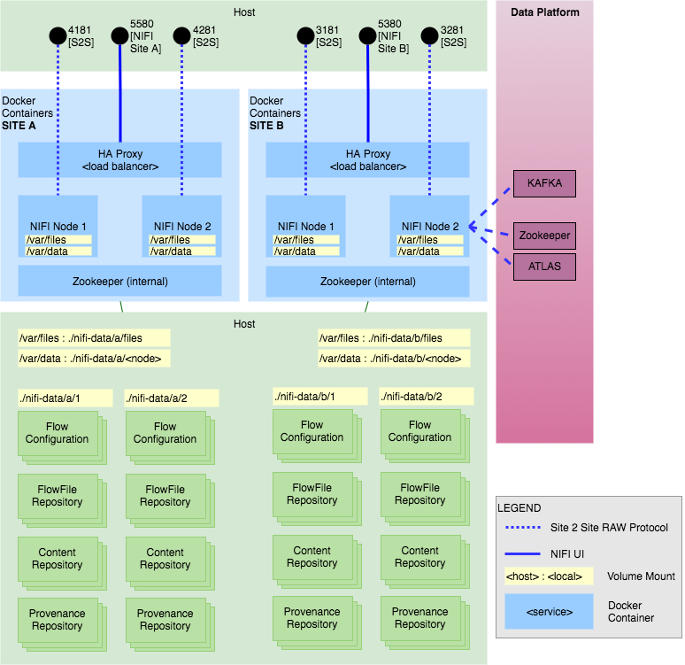

# Architecture

- Two NIFI Clusters running in docker containers

# Building the NiFi Multi-site clusters

Set DOCKER_HOSTADDR to the IP address of the host that will be running the NIFI clusters.  Needed for Site to Site.

Set HADOOP_ADDR to the location of the HDFS environment (can be a hostname or IP).  Needed for the HDFS processors.

    export DOCKER_HOSTADDR=174.138.41.167

    export HADOOP_ADDR=174.138.41.167

Use docker-compose to build the containers for the two sites:

    cd nifi-cluster-docker

    docker-compose -f docker-compose-site-a.yml -p nificluster_a build

    docker-compose -f docker-compose-site-b.yml -p nificluster_b build

Note: For more complicated hdfs configuration, the hdfs-site.xml file can be overwritten by creating a new Dockerfile and including:
    ADD ./hdfs-site.xml $NIFI_HOME/conf

# Running the NIFI clusters

## Preparing HDFS Folders

A root folder on HDFS should be setup for NIFI:
- /user/nifi

      su - hadoop -c "(export JAVA_HOME=/usr/java/latest && cd /opt/hadoop-2.8.1 && ./bin/hdfs dfs -mkdir /user/nifi)"

      su - hadoop -c "(export JAVA_HOME=/usr/java/latest && cd /opt/hadoop-2.8.1 && ./bin/hdfs dfs -chown -R nifi: /user/nifi)"

## Preparing NIFI-DATA Folders

    mkdir -p nifi-data/a/1/conf nifi-data/a/2/conf nifi-data/a/files
    mkdir -p nifi-data/b/1/conf nifi-data/b/2/conf nifi-data/b/files
    cp flow-a.xml.gz nifi-data/a/1/conf/flow.xml.gz
    cp flow-a.xml.gz nifi-data/a/2/conf/flow.xml.gz
    cp flow-b.xml.gz nifi-data/b/1/conf/flow.xml.gz
    cp flow-b.xml.gz nifi-data/b/2/conf/flow.xml.gz

    mkdir -p nifi-data/a/files/scenario1/landing
    mkdir -p nifi-data/a/files/scenario2/landing
    mkdir -p nifi-data/a/files/scenario3/landing
    mkdir -p nifi-data/a/files/scenario4/landing
    mkdir -p nifi-data/a/files/scenario5/landing
    mkdir -p nifi-data/a/files/scenario6/landing
    mkdir -p nifi-data/a/files/scenario7/landing
    mkdir -p nifi-data/a/files/scenario8/landing

    chown -R hadoop:docker nifi-data

    NOTE: The NIFI user running in the container has UID = 1000.  So the owner of nifi/data must be the user with UID 1000 on the host server.

## Running

    docker-compose -f docker-compose-site-a.yml -p nificluster_a up -d
    docker-compose -f docker-compose-site-b.yml -p nificluster_b up -d

## Verifying a particular instance

You can check the logs by executing bash shell within the particular container:

    docker-compose -f docker-compose-site-a.yml -p nificluster_a exec nifi-node-1 bash
    docker-compose -f docker-compose-site-a.yml -p nificluster_a exec nifi-node-2 bash

    docker-compose -f docker-compose-site-b.yml -p nificluster_b exec nifi-node-1 bash
    docker-compose -f docker-compose-site-b.yml -p nificluster_b exec nifi-node-2 bash

You can go to the following, where 'nifi.demo' can be added to your hosts file to match $DOCKER_HOSTADDR:

Site A: http://nifi.demo:5080/nifi

Site B: http://nifi.demo:6080/nifi

## Running the scenario tests:

### Scenario 1

cp sample-files/sample_1 nifi-data/a/files/scenario1/landing/data_1

Expected result:
- File written to: ./nifi-data/a/files/scenario1/output/data_1

### Scenario 2

cp sample-files/sample_1 nifi-data/a/files/scenario2/landing/data_2

Expected result:
- File written to: ./nifi-data/a/files/scenario2/output/data_2.out

### Scenario 3

cp sample-files/sample_1 nifi-data/a/files/scenario3/landing/data_3

Expected result:
- File written to: ./nifi-data/a/files/scenario3/backup/data_3
- File written to: hdfs : /user/nifi/backup

### Scenario 4

cp sample-files/sample_1 nifi-data/a/files/scenario4/landing/data_4

Expected result:
- File written to: ./nifi-data/a/files/scenario4/inbox/data_4
- File written to: hdfs : /user/nifi/inbox

### Scenario 5

cp sample-files/sample_1 nifi-data/a/files/scenario5/landing/data_5

Expected result:
- File written to: hdfs : /user/nifi/site_b_inbound

### Scenario 6

Site B has a daily scheduled job to call: wwww.google.com.

Expected result:
- File written to: ./nifi-data/a/files/scenario6/out/home_google.html.gz
- File written to: hdfs : /user/nifi/scenario6/out
- File written to: hdfs : /user/nifi/receiver

### Scenario 7 (Output Port)

Schedule for calling: www.google.com with a filename: google_thurs.html.

Expected result:
- File written to: /var/files/receive

### Scenario 8 (Funnel)

Place a file in /var/files/scenario8/landing1 and /var/files/scenario8/landing2.

Expected result:
- Two files written to: /var/files/scenario8/out

# Debugging

To enable remote debugging and JRebel integration with a NIFI instance:

    (cd nifi-node && docker build --tag nifi-node .)

    (cd nifi-node-debug && docker build .)

    docker-compose -f docker-compose-site-a-debug.yml -p nificluster_a build

    docker-compose -f docker-compose-site-a-debug.yml -p nificluster_a up -d

    docker-compose -f docker-compose-site-a-debug.yml -p nificluster_a exec nifi-node-1 bash

    docker-compose -f docker-compose-site-a-debug.yml -p nificluster_a down

Debug port: 5010

JRebel port: 5011
